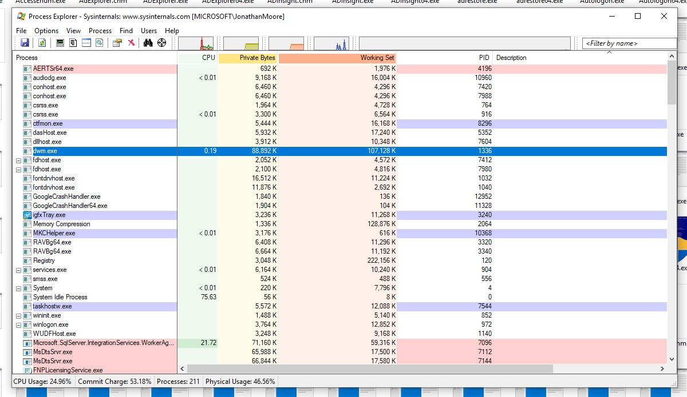

# NT Projects

This project fosters the begining of a NT Source Tree.

Currently uses a VS2005 environment Please use Nmap and open the 'microsoft.xml'
port scan.

Use the NTENV shortcut to launch the NT ENV. And use Sysinternals and below is 'process explorer'

'Dont Tell Me'
'I Dont Have to Try'